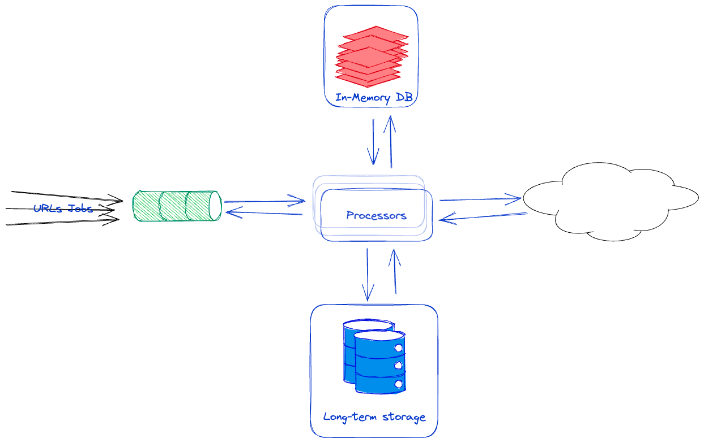

# fetchMultipleUrls(urls, numThreads)
Fetches an array of URLs which contain JSON data and returns their contents in a promise.

## Parameters
- **urls (array)**: An array of object to fetch.
  - URL Object consist of the following:
    - url (string)
    - headers (object)
    - httpMethod (string)
- **config (object)**: Contains configurations for the package such as:
  - numThreads (integer) the maximum number of threads to fetch the data with.


Returns
A promise that resolves to an array of the object data looks like the following:
```
{
      code: 200,# could be status code or client errors 
      data: {user:1}, # response got from the server, or error with the client {error: "timout"}
      status: "success" # failure or success of the request
}
```

## Errors
No matter what kind of failure the package will face during the request will be determined by `status:"fail"`
but the code and data will vary depend on the following:
- **Server errors:** Errors returned from the server
  - Any HTTP status code outside the range of 200-299 as an error
- **Client errors:** network errors, such as DNS resolution failures or connection timeouts, that are not related to the server's response. These errors are typically thrown by the underlying HTTP client library used by Axios (such as XMLHttpRequest or the Node.js http/https modules)
## Future improvements
- Could use retries and circuit breakers to improve the performance and relability
- IP pool to aviod server IP blocking
- Configure the timeout per request
- Configure the logging to allow other loggers as well as the log level
- Collect/Expose stats regarding failures and successes in requests 
- Add lint rules to maintain code quality
- Add CI/CD pipeline to run the tests and publishing new tags
- Eventually we will run out of memory and if we didn't we will be limited by the number of requests/cores/memory/SLA meaning we will need multiple machines to process the work something similar to the following.
  - 
    - Long-term storage: for storing requests responses, could be NoSQL due to the nature of request's response
    - Processors for processing the URL jobs
    - In-memory DB: for storing the circuit break info as well as the stats information
    - Queue: for buffering the load and relability to make sure that the procesors are going to process the request job no matter what.